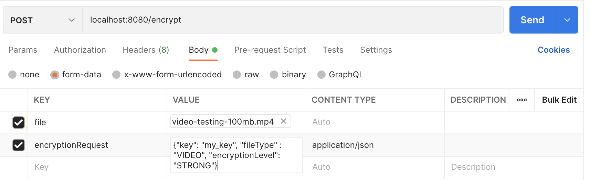
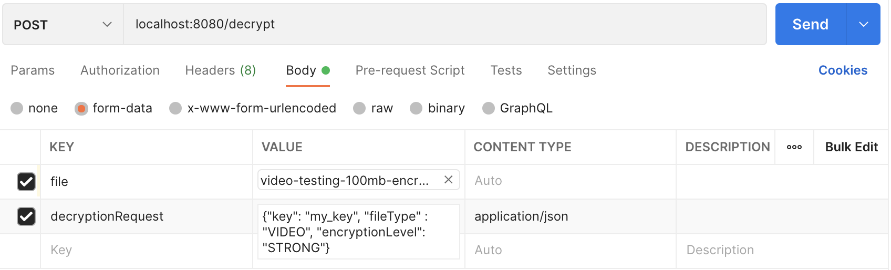

The code will work for text file and images. Need changes to support video

Developer Notes:

To compile: 
```console
./mvnw clean install
```

To run: 
```console
./mvnw spring-boot:run
```

The server will start at localhost:8080

We need to use a tool like Postman to make the requests and attach files

Encryption Request Example:



Decryption Request Example:

